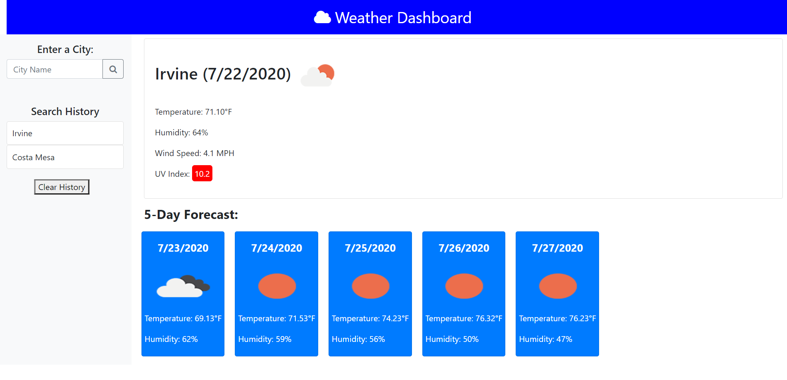

This application is a simple weather dashboard application that displays some basic weather information for the current day, and also a 5-day forecast for the future.  The sidebar on the left contains an input field to enter a city in the world to search.  There is also a search history (using Local Storage) that will populate your recent searches (not including duplicates), along with a clear button that will clear all sections and your Local Storage.

Current weather section provides the following data:  
-City name, date, and an icon of current weather conditions  
-Temperature in degrees F  
-Humidity in %  
-Wind Speed in MPH  
-UV Index (value color-coded: Green for favorable, Orange for moderate, and Red for severe)

5-Day Forecast section provides the following data:  
-Date  
-Icon of day's weather conditions  
-Temperature in degrees F  
-Humidity in %

https://raytieu.github.io/weather-dashboard/

